# Survey Mamba in 2048 Game

*Dinh Hoang Duong (25C11034) and Duong Tan Phat (25C11057)*

---

Deep Q-Networks (DQN) have been widely used in reinforcement learning tasks, including game playing. In this survey, we explore the application of Mamba, a linear-time sequence modeling architecture, in the context of the 2048 game. We review related works in deep reinforcement learning and sequence modeling, and present experiments demonstrating the effectiveness of Mamba in improving the performance of DQN agents in the 2048 game. Finally, we conclude with insights and future directions for research in this area.

## Introduction

Deep Q-Networks (DQN) have shown remarkable success in various reinforcement learning tasks, particularly in game playing. Different variants of DQN, such as Double DQN, Dueling DQN, and Distributional DQN, have been proposed to address specific challenges in reinforcement learning and improve the performance of agents. On the other hand, Mamba is a novel sequence modeling architecture that has been shown to be effective in various tasks, including natural language processing and time series forecasting. Prior to our previous study (Dinh et al. [6]), in this paper, we explore the application of Mamba in the context of the 2048 game, a popular single-player puzzle game that requires strategic planning and decision-making.

## Related Works

Deep Q-Network (DQN), introduced by Mnih et al. [1], marked a breakthrough in reinforcement learning by combining Q-learning with deep neural networks. The core idea is to approximate the optimal action-value function $Q^*(s, a)$ using a convolutional neural network that takes raw game pixels as input and outputs Q-values for each action. To stabilize training, DQN employs two key mechanisms: an experience replay buffer that stores and randomly samples past transitions to break temporal correlations, and a separate target network that is periodically updated to provide stable Q-value targets. DQN achieved human-level performance on many Atari 2600 games, demonstrating that deep reinforcement learning could scale to high-dimensional sensory inputs. However, DQN is known to suffer from overestimation bias, where the max operator in the Bellman update uses the same network for both action selection and evaluation, leading to systematically inflated Q-value estimates.

Double DQN (DDQN), proposed by van Hasselt et al. [2], directly addresses the overestimation bias inherent in standard DQN. The key improvement is the decoupling of action selection from action evaluation in the target computation: the online network selects the best action, while the target network evaluates its Q-value. This simple modification, formalized as $Y_t = R_{t+1} + \gamma Q(S_{t+1}, \arg\max_a Q(S_{t+1}, a; \theta_t); \theta_t^-)$, where $\theta_t$ and $\theta_t^-$ are the online and target network parameters respectively, significantly reduces the positive bias. Empirically, Double DQN was shown to produce more accurate value estimates and achieve higher scores across multiple Atari games compared to standard DQN. In the context of the 2048 game, this decoupling helps the agent avoid overestimating the value of suboptimal moves, leading to more stable learning trajectories.

Dueling Double DQN (DDDQN), introduced by Wang et al. [3], improves upon Double DQN by modifying the network architecture rather than the learning algorithm. The dueling architecture separates the Q-value function into two streams: a state-value function $V(s)$ that estimates the value of being in a given state, and an advantage function $A(s, a)$ that estimates the relative benefit of each action compared to others. These two streams share a common feature extraction backbone and are combined via $Q(s, a) = V(s) + (A(s, a) - \frac{1}{|\mathcal{A}|}\sum_{a'} A(s, a'))$ to produce the final Q-values. This architectural inductive bias allows the network to learn which states are valuable independent of the actions, which is particularly beneficial in games like 2048 where many board configurations are inherently poor regardless of the chosen move. The dueling architecture achieved state-of-the-art results on the Atari benchmark at the time of publication, demonstrating that architectural innovations can yield significant performance gains without additional algorithmic complexity.

Hierarchical DQN (H-DQN), proposed by Kulkarni et al. [5], extends DQN to operate at multiple levels of temporal abstraction. The architecture consists of a meta-controller that sets high-level goals (e.g., reaching a specific tile configuration) and a controller that executes primitive actions to achieve those goals. The meta-controller is rewarded only when a goal is achieved, while the controller receives intrinsic rewards for making progress toward the current goal. This hierarchical decomposition enables the agent to explore more efficiently in environments with sparse extrinsic rewards. In the 2048 game, H-DQN can set sub-goals such as forming a 256 or 512 tile, allowing the controller to learn short-horizon behaviors that compose into long-term strategies. However, the stochastic nature of tile spawning in 2048 can make goal achievement unreliable, potentially destabilizing the meta-controller's learned Q-values over extended training.

Quantile Regression DQN (QR-DQN), introduced by Dabney et al. [4], takes a distributional approach to reinforcement learning. Instead of estimating the expected return $Q(s, a)$, QR-DQN models the full distribution of returns by predicting a set of quantiles $\{\theta_i\}_{i=1}^N$ for each state-action pair. The network outputs $N$ quantile values, and the loss function is the quantile Huber loss, which asymmetrically penalizes over- and under-estimations based on the quantile level $\tau_i$. The expected Q-value is then obtained by averaging over the predicted quantiles. By capturing the entire return distribution, QR-DQN provides a richer learning signal that helps the agent distinguish between actions with similar expected values but different levels of risk. This is particularly valuable in 2048, where the random tile spawn introduces substantial variance in outcomes. QR-DQN achieved state-of-the-art performance on the Atari-57 benchmark, demonstrating the power of distributional reinforcement learning.

Dinh et al. [6] conducted a comprehensive survey of DQN variants in the 2048 game environment, implementing and evaluating DQN, Double DQN, Dueling Double DQN, QR-DQN, and H-DQN. Their study utilized Optuna for hyperparameter tuning and evaluated all models across 300 to 5000 training episodes. Their results showed that QR-DQN achieved the highest average return (~2956 at 5000 episodes) and average max tile (~252), while Dueling Double DQN also demonstrated strong performance. Notably, H-DQN exhibited a catastrophic policy collapse after extended training, and Double DQN showed conservative but stable learning with fewer illegal action attempts. Their work established a solid baseline for evaluating architectural improvements in the 2048 domain.

Since Q-Network and its variants are model independent, they can be easily combined with Mamba without any major modifications to the original architecture. Mamba has been shown to be effective even in small sizes [7], which makes it a promising candidate for improving the performance of DQN agents in the 2048 game. In this survey, we investigate the potential benefits of integrating Mamba into DQN agents and evaluate its performance in the context of the 2048 game.

## Experiments

### Baseline

We use Dinh et al.'s implementation of DQN as our baseline agent for the 2048 game. We have 5 variants of DQN: DQN, Double DQN, Dueling DQN, H-DQN and QR-DQN. We replace the model component with Mamba.

<table>
<tr>
<th>QNetwork</th>
<th>DuelingQNetwork</th>
<th>QuantileQNetwork</th>
</tr>
<tr>
<td>

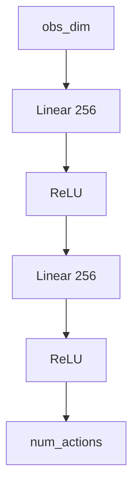

</td>
<td>

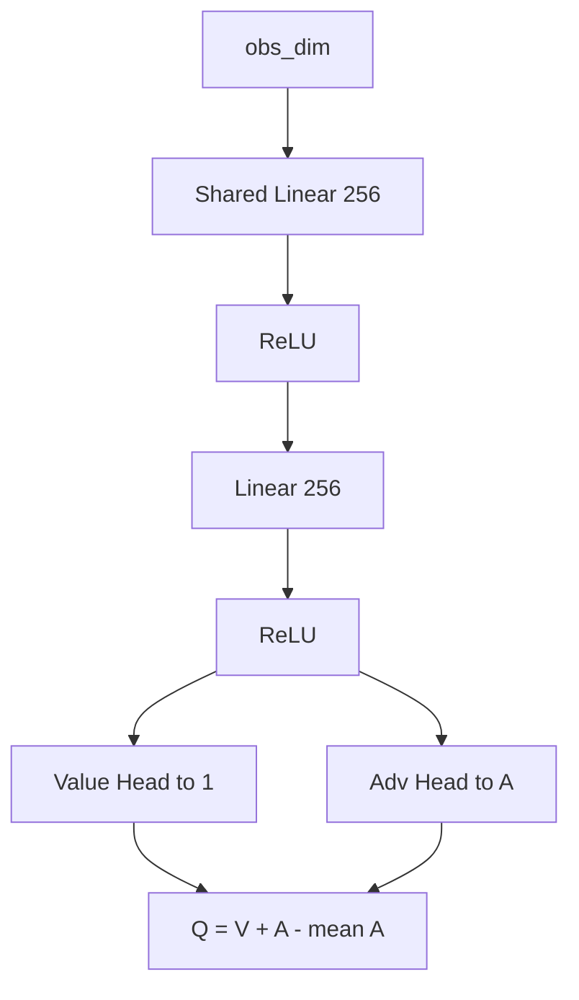

</td>
<td>

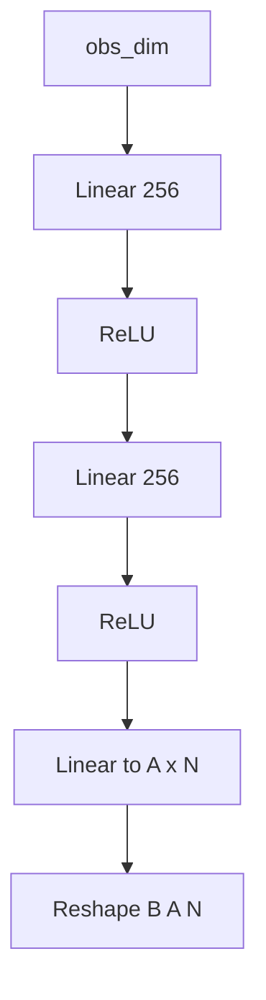

</td>
</tr>
</table>

The original DQN variants use standard feed-forward MLP architectures with ReLU activations. `QNetwork` is a simple 3-layer MLP. `DuelingQNetwork` splits into value and advantage streams after a shared backbone. `QuantileQNetwork` outputs a distribution over returns via multiple quantile heads.

<table>
<tr>
<th>Mamba2QNetwork</th>
<th>Mamba2DuelingQNetwork</th>
<th>Mamba2QuantileQNetwork</th>
</tr>
<tr>
<td>

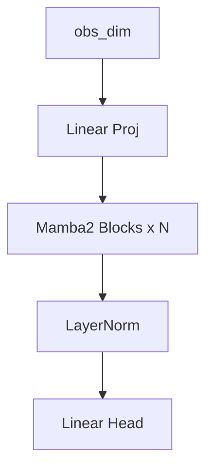

</td>
<td>

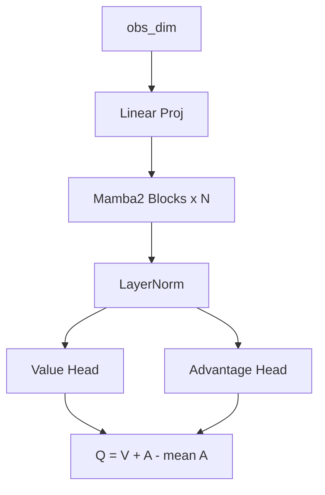

</td>
<td>

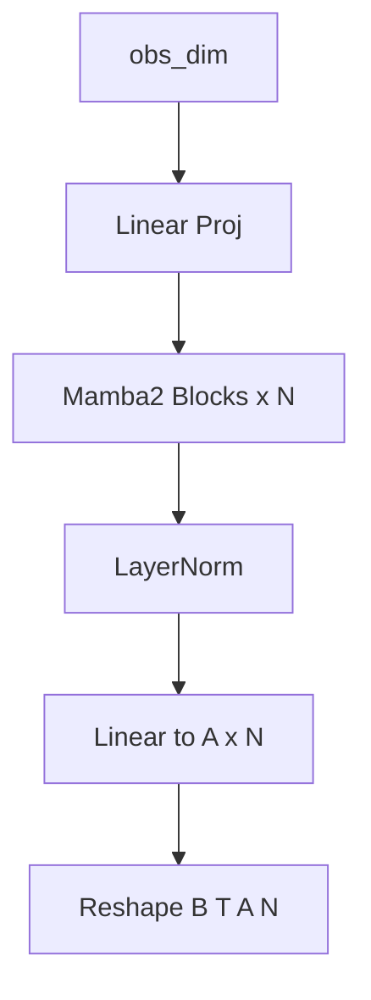

</td>
</tr>
</table>

The Mamba-enhanced variants replace the feed-forward MLP backbone with stacked Mamba2 blocks featuring residual connections and layer normalization. The input is first projected to the hidden dimension, then processed through multiple Mamba2 selective state-space model layers. The output heads (Q-value, value/advantage, or quantile distribution) remain identical to the original variants, ensuring a fair comparison. Mamba2's sequence modeling capability allows the network to capture temporal dependencies in the state representation.

The above diagrams illustrate the model architectures of the original DQN variants and their corresponding Mamba-enhanced versions. The other part of algorithm remains unchanged, which allows us to directly compare the performance of the original DQN agents with their Mamba-enhanced counterparts.

### Hyperparameters Tuning

Thanks to optuna, we can easily tune the hyperparameters of our agents to achieve optimal performance. We perform a systematic search over a range of hyperparameters.

The best hyperparameters found for Mamba-enhanced models are summarized below:

| Hyperparameter | Mamba DQN | Mamba Double DQN | Mamba Dueling Double DQN | Mamba QR-DQN | Mamba H-DQN |
|---|---|---|---|---|---|
| **Buffer Size** | 200,000 | 200,000 | 20,000 | 200,000 | 20,000 |
| **Batch Size** | 64 | 64 | 64 | 64 | 256 |
| **Sequence Length** | 16 | 12 | 4 | 16 | 4 |
| **Gamma ($\gamma$)** | 0.974 | 0.958 | 0.956 | 0.994 | 0.997 |
| **Learning Rate (`lr`)** | 4.14e-5 | 5.12e-5 | 6.60e-4 | 7.49e-5 | 1.79e-4 |
| **Target Sync Every** | 500 | 100 | 100 | 100 | 250 |
| **Learn Start** | 2000 | 5000 | 5000 | 2000 | 5000 |
| **Learn Every** | 8 | 4 | 8 | 2 | 8 |
| **Eps End** | 0.085 | 0.095 | 0.197 | 0.074 | 0.045 |
| **Eps Decay Steps** | 5,000 | 5,000 | 50,000 | 50,000 | 20,000 |
| **Grad Clip** | 14.82 | 5.65 | 16.20 | 8.43 | 7.01 |
| **Hidden Dim** | 256 | 256 | 256 | 256 | 256 |
| **Mamba Layers** | 4 | 2 | 3 | 3 | 2 |
| **Mamba State Dim** | 64 | 64 | 128 | 128 | 64 |
| **Mamba Conv Dim** | 4 | 2 | 4 | 2 | 2 |
| **Mamba Expand** | 2 | 1 | 3 | 1 | 1 |

The hyperparameter importance analysis for both the original DQN variants (Dinh et al.) and the Mamba-enhanced models is shown below:

| DQN | Double DQN |
| :---: | :---: |
| 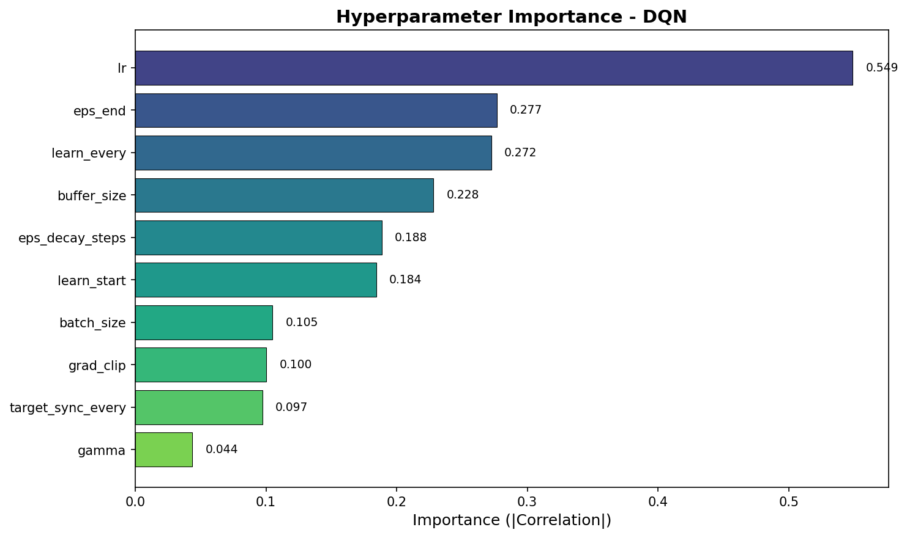 | 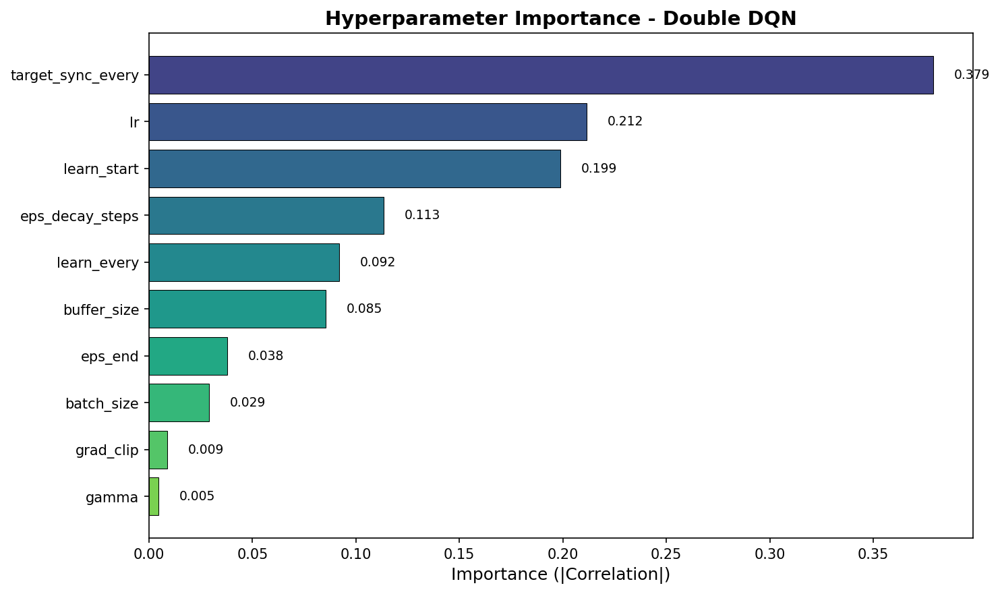 |
| **Dueling Double DQN** | **QR-DQN** |
| 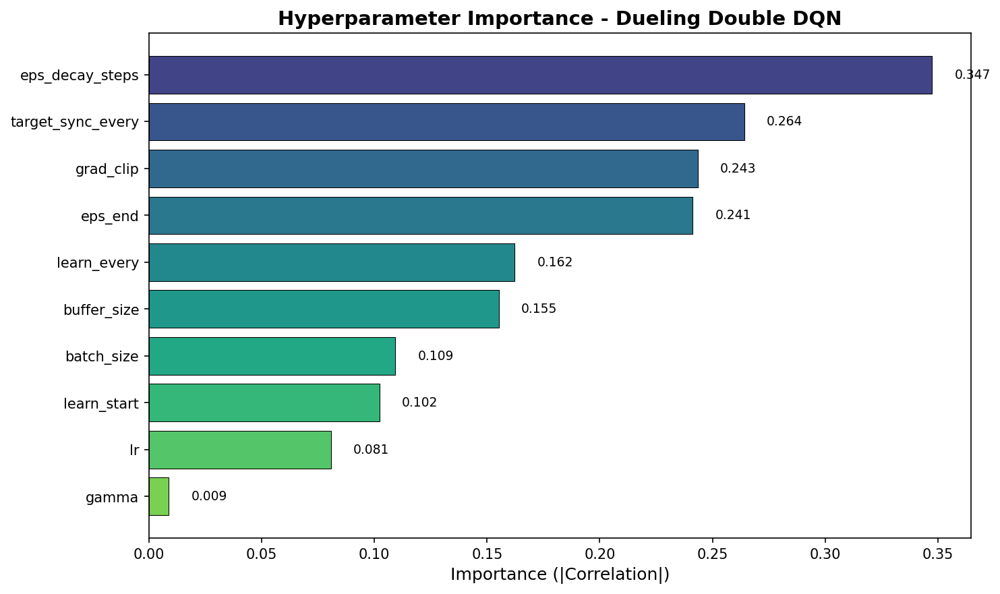 | 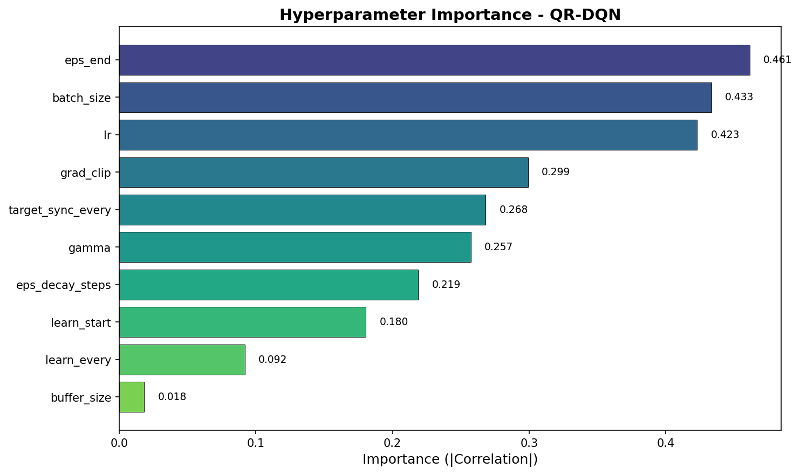 |
| **H-DQN** | |
| 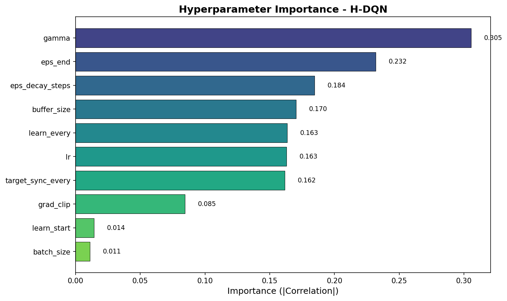 | |

| Mamba DQN | Mamba Double DQN |
| :---: | :---: |
| 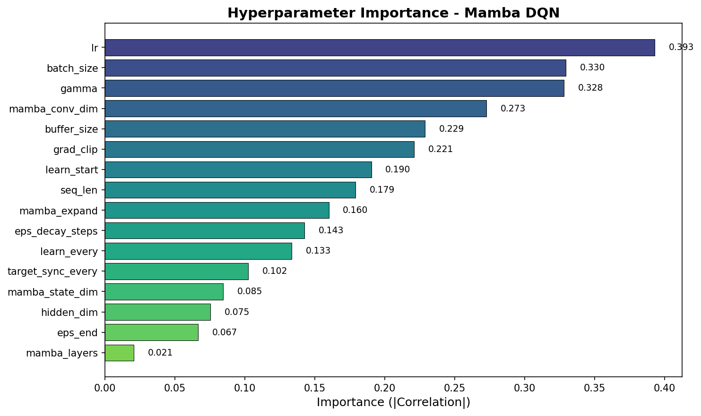 | 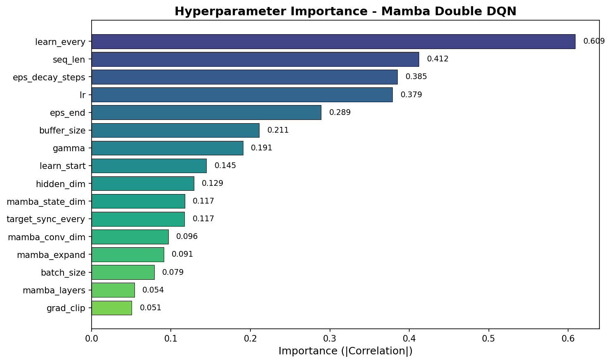 |
| **Mamba Dueling Double DQN** | **Mamba QR-DQN** |
| 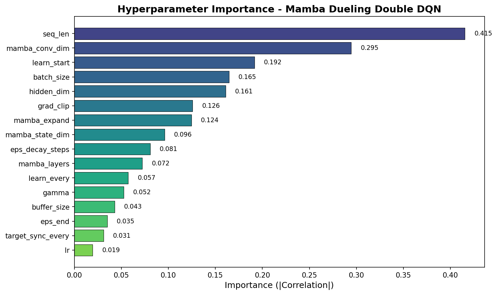 | 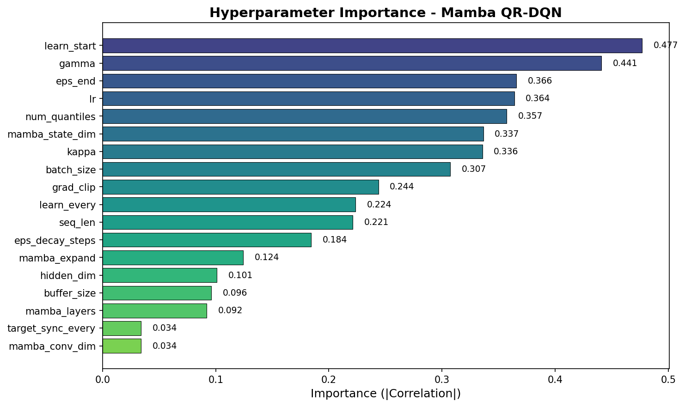 |
| **Mamba H-DQN** | |
| 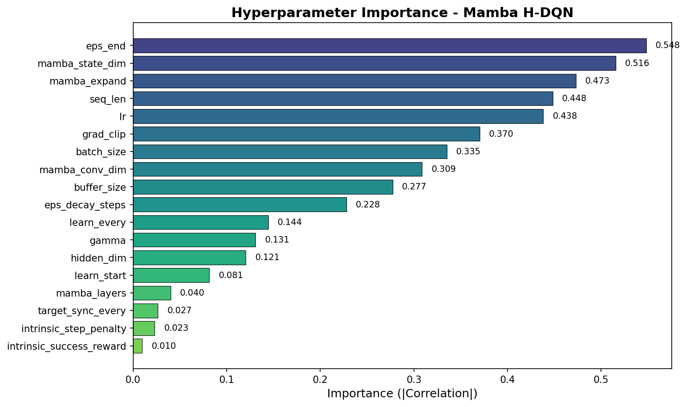 | |

The hyperparameter importance plots reveal notable differences between the original DQN variants and their Mamba-enhanced counterparts. For the original DQN, learning rate (`lr`) dominates as the most critical hyperparameter, consistent with the sensitivity of standard feed-forward networks to step-size choices. In contrast, Mamba DQN shows a more distributed importance profile, with `eps_end`, `buffer_size`, and `mamba_layers` emerging as key factors, suggesting that the Mamba backbone is less sensitive to learning rate but more dependent on exploration scheduling and architectural depth. For Mamba Double DQN, `eps_decay_steps` and `eps_end` dominate, indicating that exploration management is critical when combining Mamba with the double Q-learning mechanism. Mamba QR-DQN shows high sensitivity to `num_quantiles` and `eps_end`, reflecting the distributional model's reliance on both quantile resolution and exploration coverage.

### Results

The following charts compare the performance of the original DQN variants (Dinh et al.) against the Mamba-enhanced models across three key metrics: average return, average game length, and total illegal action attempts.

| Average Return | Average Game Length |
| :---: | :---: |
| 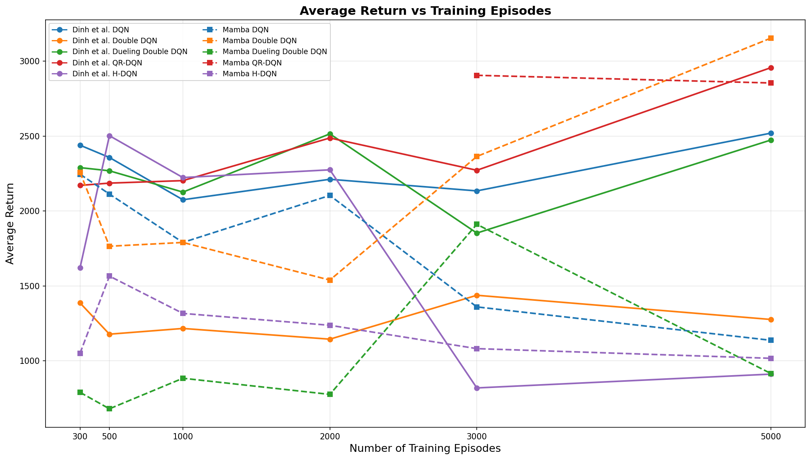 | 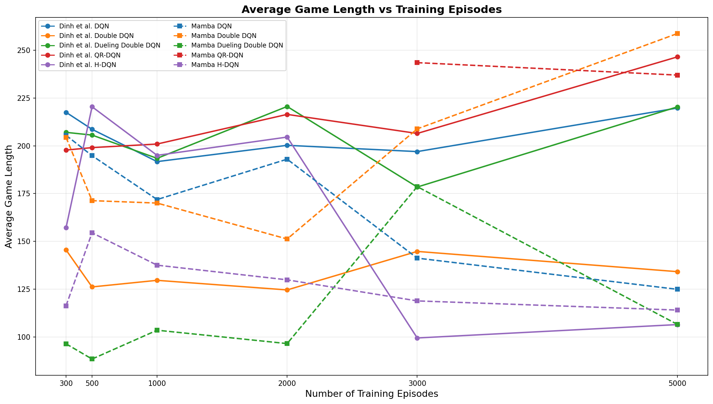 |
| **Total Illegal Action Attempts** | |
| 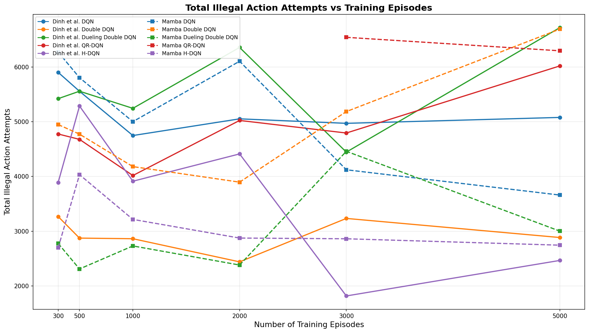 | |

**Average Return Analysis.** The Mamba-enhanced models demonstrate competitive performance across most variants. Notably, Mamba Double DQN achieves the highest average return at 5000 episodes (3154.0), significantly outperforming the original Double DQN (1277.0) and even surpassing the best original variant (QR-DQN at 2956.9). Mamba DQN starts strong at 300 episodes (2246.3) but exhibits a performance decline after 3000 episodes, dropping to 1138.0 at 5000 episodes — a pattern that suggests the standard Mamba DQN may overfit or suffer from instability in longer training horizons. Mamba QR-DQN achieves 2855.2 at 5000 episodes, slightly below the original QR-DQN (2956.9), though it was only evaluated at 3000 and 5000 episodes. Mamba Dueling Double DQN struggles significantly, with returns hovering around 700–900 for most checkpoints except a spike at 3000 episodes (1911.8), suggesting that the combination of Mamba with the dueling architecture may require more careful hyperparameter tuning or architectural adjustments. Mamba H-DQN shows consistently lower returns (1000–1600 range) compared to the original H-DQN's peak at 2503.3 (500 episodes), indicating that the hierarchical structure does not benefit as much from the Mamba backbone.

**Average Game Length Analysis.** The game length trends closely mirror the average return patterns, as longer games generally correlate with higher scores in 2048. Mamba Double DQN achieves the longest average game length at 5000 episodes (258.7 steps), followed by Mamba QR-DQN (237.0) and original QR-DQN (246.5). Mamba DQN shows a declining game length after 2000 episodes, consistent with its return degradation. Mamba Dueling Double DQN and Mamba H-DQN maintain shorter game lengths throughout training, reflecting their lower overall performance.

**Total Illegal Action Attempts Analysis.** The Mamba-enhanced models generally exhibit higher numbers of illegal action attempts compared to their original counterparts. Mamba Double DQN records 6693 illegal attempts at 5000 episodes versus the original Double DQN's 2884. This pattern holds across most Mamba variants, suggesting that the Mamba backbone, while improving return performance, may produce less conservative action selection policies. The original H-DQN and Double DQN maintain the lowest illegal action counts, consistent with their known conservative behavior. This trade-off between exploration (more illegal attempts) and return maximization is a key consideration when deploying Mamba-enhanced agents.

## Conclusion

In this survey, we investigated the integration of Mamba2, a linear-time sequence modeling architecture based on selective state space models, into five DQN variants for the 2048 game. Our experiments demonstrate that Mamba-enhanced models can achieve competitive or superior performance compared to their feed-forward counterparts, particularly in the case of Mamba Double DQN, which achieved the highest average return (3154.0) and game length (258.7) at 5000 training episodes across all evaluated models.

However, the results also reveal important caveats. The performance gains from Mamba are not uniform across all variants: Mamba Dueling Double DQN and Mamba H-DQN underperform relative to their original counterparts, suggesting that the Mamba backbone interacts differently with different architectural inductive biases. The standard Mamba DQN exhibits a performance degradation after extended training, indicating potential stability issues that warrant further investigation. Additionally, Mamba-enhanced models tend to produce more illegal action attempts, reflecting a less conservative policy that may be more exploratory but also riskier.

The hyperparameter importance analysis reveals that Mamba models shift the sensitivity away from learning rate toward exploration parameters (`eps_end`, `eps_decay_steps`) and architectural choices (`mamba_layers`, `mamba_state_dim`), providing practical guidance for future tuning efforts.

Future work could explore several directions: (1) investigating longer training horizons to determine whether Mamba models eventually stabilize or continue to degrade; (2) adapting the Mamba architecture specifically for the dueling and hierarchical frameworks; (3) exploring different Mamba configurations (e.g., number of layers, state dimension) more systematically; and (4) combining Mamba with other recent advances in deep reinforcement learning, such as Rainbow DQN or data-efficient variants.

## References

[1] Playing Atari with Deep Reinforcement Learning, Volodymyr Mnih et al.

[2] Deep Reinforcement Learning with Double Q-Learning, Hado van Hasselt et al.

[3] Dueling Network Architectures for Deep Reinforcement Learning, Ziyu Wang et al.

[4] Distributional Reinforcement Learning with Quantile Regression, Will Dabney et al.

[5] Hierarchical Deep Reinforcement Learning: Integrating Temporal Abstraction and Intrinsic Motivation, Tejas D. Kulkarni et al.

[6] Report of Reinforcement Learning for 2048 Game, Duong Dinh Hoang et al.

[7] Mamba: Linear-Time Sequence Modeling with Selective State Spaces, Tri Dao and Albert Gu.

[8] Transformers are SSMs: Generalized Models and Efficient Algorithms Through Structured State Space Duality, Tri Dao and Albert Gu.
